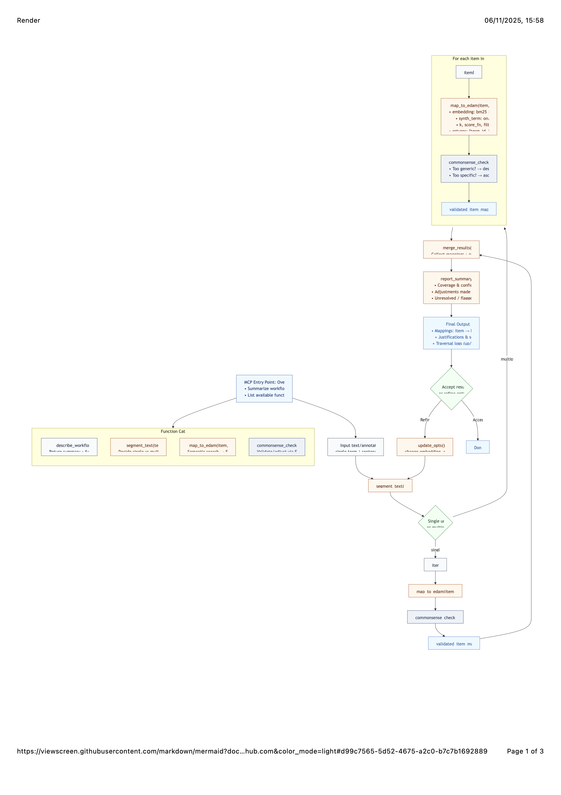
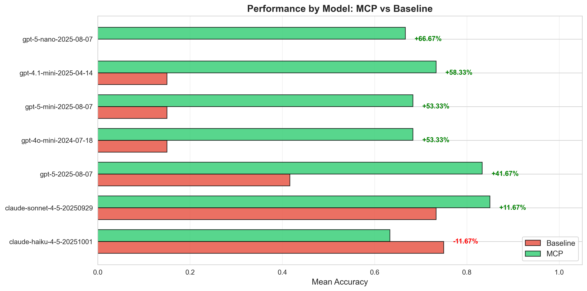
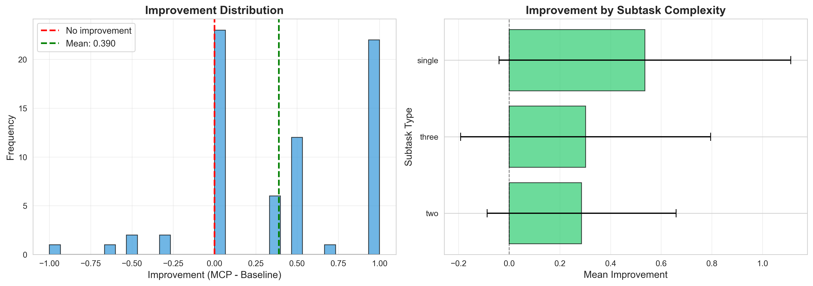
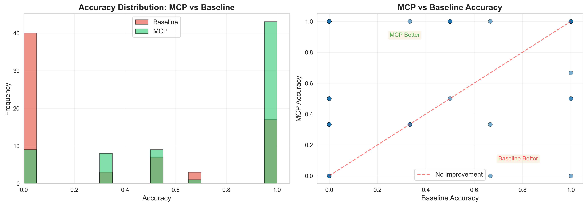
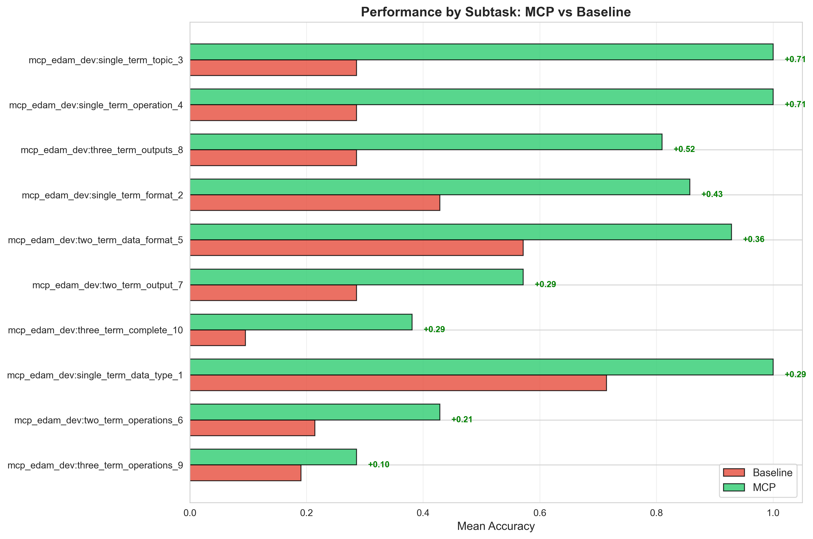
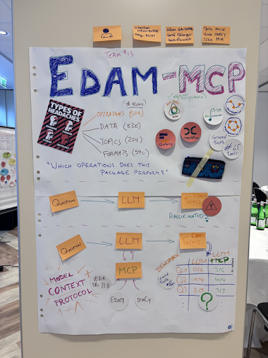

# Abstract

Identifying the most appropriate bioinformatics tool for a task remains challenging. Annotating tools with EDAM ontology terms can help but manual annotation is labour-intensive, error-prone, and difficult to scale. At BioHackathon Europe 2025, our team explored how Large Language Models (LLMs) can assist this process through the Model Context Protocol (MCP), an emerging open standard that enables LLMs to call deterministic functions rather than generate free text alone, using metabolomics as a domain use case. We developed the foundation of an MCP-based workflow that grounds tool descriptions in the EDAM ontology, improving reproducibility and semantic precision. Two core modules, entry-point specification and semantic text segmentation, were completed during the hackathon, while additional mapping, validation, and reporting functions were outlined for follow-up development. Benchmarking integrated with the BioChatter framework demonstrated that MCP-assisted models outperform unconstrained baselines on initial tests using metabolomics packages from bio.tools. Ongoing work will expand benchmarking datasets, refine term-mapping logic, and extend the workflow to proteomics, supporting scalable, ontology-driven annotation across the ELIXIR ecosystem.

# Introduction

## Background

[Metabolomics](https://elixir-europe.org/communities/metabolomics), [fluxomics](https://elixir-europe.org/internal-projects/commissioned-services/fluxomics-workflows), and [proteomics](https://elixir-europe.org/communities/proteomics) face ongoing interoperability challenges despite shared platforms and analytical frameworks (e.g. MS-based workflows and bioimaging pipelines).  
While these communities have advanced standardisation through [EDAM-annotated Bioconductor packages](https://doi.org/10.37044/osf.io/dsgnw_v1), several gaps persist:  
1. Manual tool annotation in [bio.tools](https://bio.tools) is labour-intensive and often inconsistent.  
2. Tool discoverability for experimentalists remains limited.  
3. Integration across ELIXIR services (Galaxy, WorkflowHub, BioContainers) requires strengthening, as identified in [ELIXIR commissioned services](https://elixir-europe.org/internal-projects/commissioned-services/proteomics-pipelines) and a related [white paper](https://f1000research.com/articles/6-875/v1).

## Objectives

This project aims to enhance the accessibility and interoperability of metabolomics and proteomics tools by leveraging Large Language Models (LLMs) for automated, ontology-driven annotation.  
We focus on integrating the [EDAM ontology](https://edamontology.org) with the Model Context Protocol (MCP) framework to provide structured, reproducible annotations of bioinformatics resources.

The MCP is an emerging open standard for structured interaction between LLMs and external tools. It defines how models can call deterministic functions—such as ontology lookups or API queries—instead of relying purely on text generation. In our context, MCP acts as a control layer ensuring that annotations derived from natural language remain grounded in the EDAM ontology and are both reproducible and machine-readable.

Key objectives include:
- Developing an LLM-based querying system for the bio.tools API.  
- Strengthening interoperability between omics tools, ELIXIR services, and Bioconductor packages.  
- Facilitating user-friendly, structured search and guided workflow usage within Galaxy’s [Metabolomics](https://workflow4metabolomics.usegalaxy.fr/) and [Proteomics](https://proteore.org/) environments.  

# Results

## Overview

During the hackathon, we extended the EDAM-MCP framework to improve ontology-driven annotation through structured, deterministic LLM interactions. Early experiments showed that unconstrained LLMs frequently hallucinate EDAM terms, producing annotations that are syntactically plausible but semantically invalid; MCP’s modular, function-based control mitigates this by enforcing explicit task definitions and reproducible behaviour.

We planned a two-layered process:

- Check whether a term already exists in EDAM; if so, return it.  
- If no match exists, suggest a new term with its proposed position in the ontology.  

The initial use case focused on metabolomics, chosen because of its diverse tools. We aimed to (1) identify a representative set of well-annotated tools, (2) create realistic Q&A benchmarks for annotation quality, and (3) evaluate the MCP workflow on this domain dataset.

## Use case: Metabolomics packages

We identified over 60 metabolomics tools in bio.tools, serving as the basis for testing EDAM annotations. These tools varied in annotation quality, so several were manually reviewed and updated during the hackathon. For benchmarking, we generated question–answer datasets for two of the selected tools (*xcms* and *recetox-aplcms*), which are available at: https://github.com/edamontology/edammcp/blob/main/benchmark.

A prototype script was created to automate dataset generation. It queries the bio.tools API for a given package and produces structured Q&A datasets suitable for benchmarking annotation accuracy.

## EDAM-MCP workflow

Applying MCP to annotation required us to design a workflow that distinguishes planning (deciding what to do) from execution (carrying it out). This ensures reproducible, logically consistent mappings and reduces the probabilistic behaviour typical of unconstrained LLMs.

The workflow begins with an entry point that provides the copilot with a structured overview of available functions and options. Two key components were implemented and tested during the hackathon:

- `get_workflow_summary()` (called `describe_workflow()` during development) - defines the MCP entry point, summarising the workflow and listing available functions, expected inputs/outputs, and configurable parameters.  
- `segment_text()` - determines whether an input should be processed as a single concept or split into multiple semantically coherent segments to improve mapping precision.

The remaining modules were designed conceptually and opened as GitHub issues for ongoing work:
- `map_to_edam()` - main mapping function linking text to EDAM ontology terms using embeddings and ontology traversal.  
- `commonsense_check()` - validation layer to assess mapping plausibility and adjust overly generic or overly specific terms.  
- `merge_results()`, `report_summary()`, and `update_opts()` - functions to aggregate results, summarise mappings, and enable parameter re-runs.

A schematic of the workflow and its interactions is shown below and detailed in [Issue #37](https://github.com/edamontology/edammcp/issues/37).

We also considered how the MCP handles EDAM branches (Operations, Topics, Data, Formats).  
Initial testing showed that querying all branches simultaneously produced imbalanced results, so we began developing specialised sub-mappers—starting with an [Operations-only mapper (PR #51)](https://github.com/edamontology/edammcp/pull/51)—to improve control and benchmarking accuracy.

## Benchmarking

To assess MCP’s contribution, we integrated a programmatic benchmarking framework with [BioChatter](https://github.com/biocypher/biochatter).  
This pipeline automatically converts the Q&A datasets into BioChatter’s benchmark format and compares model outputs with and without MCP guidance.  
The setup was merged in [BioChatter PR #321](https://github.com/biocypher/biochatter/pull/321).

Preliminary results (based on a small, 10-question development benchmark) indicate that MCP-supported models generally outperform baseline LLMs in producing accurate EDAM annotations.  
An exception was Claude Haiku, which performed well even without MCP—likely reflecting the simplicity of the dataset.  
Future work will extend the benchmark to larger datasets and introduce versioned MCP releases for result traceability.

Benchmark data and scripts are available in the [EDAM-MCP repository](https://github.com/edamontology/edammcp/tree/main/benchmark).

## biocEDAM edamize

TODO – add summary of discussions, tests, and outcomes.

# Discussion

Future plans include extending both the technical scope and practical applicability of the EDAM-MCP workflow. The approach is intended to support individual curators via human-in-the-loop annotation, as well as ecosystem maintainers seeking automated, large-scale annotation pipelines across resources such as bio.tools and Bioconductor.

Future plans include:
- Integrating new metabolomics and proteomics concepts into EDAM.  
- Expanding the ground-truth dataset.  
- Improving term-suggestion logic and integration with other EDAM components.  
- Enhancing text-based annotation from diverse sources (e.g. package metadata, documentation).

# Data availability

All scripts and materials developed during the hackathon are available in the [EDAM-MCP GitHub repository](https://github.com/edamontology/edammcp).  
The repository also includes benchmarking data, workflow specifications, and issue tracking for ongoing development.

## Acknowledgements

This work was carried out during the ELIXIR BioHackathon Europe 2025, held in Berlin, Germany, and organised by [ELIXIR](https://elixir-europe.org/). CR is part of the Institut Français de Bioinformatique (IFB, UAR 3601), funded by the Programme d’Investissements d’Avenir through the Agence Nationale de la Recherche (ANR-11-INBS-0013). This project also benefited from the Chan Zuckerberg Initiative EOSS6 grants "Software for Science: Ontological resource tagging and discovery for Bioconductor" (2024-342819 and 2024-342820).

## References

## Supplementary material

### Supplementary Figure S1: Mid-week reporting poster

**Supplementary Figure S1.** Mid-week reporting poster used during BioHackathon Europe 2025 to communicate early design decisions, illustrate EDAM branches, and motivate the use of the Model Context Protocol (MCP) to mitigate LLM hallucinations during ontology-driven tool annotation.
