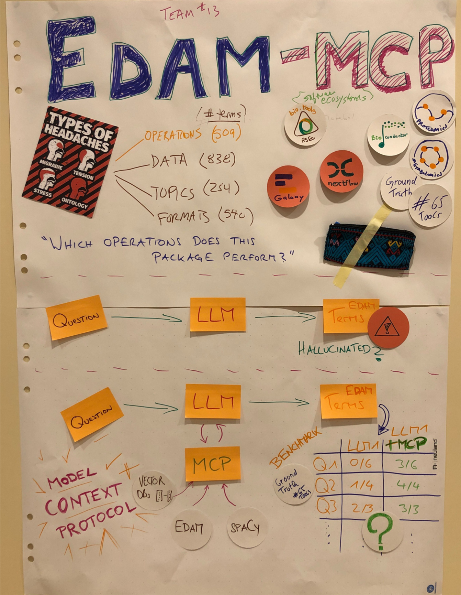
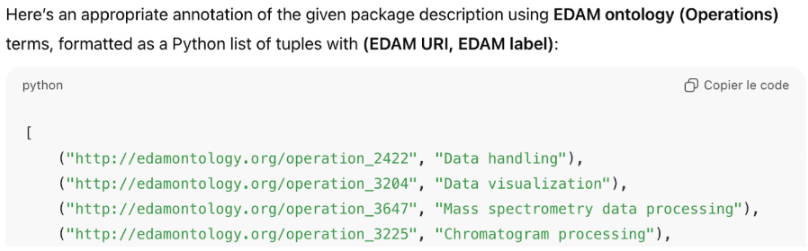
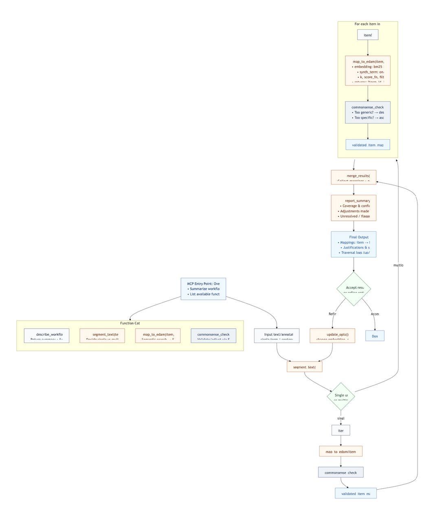
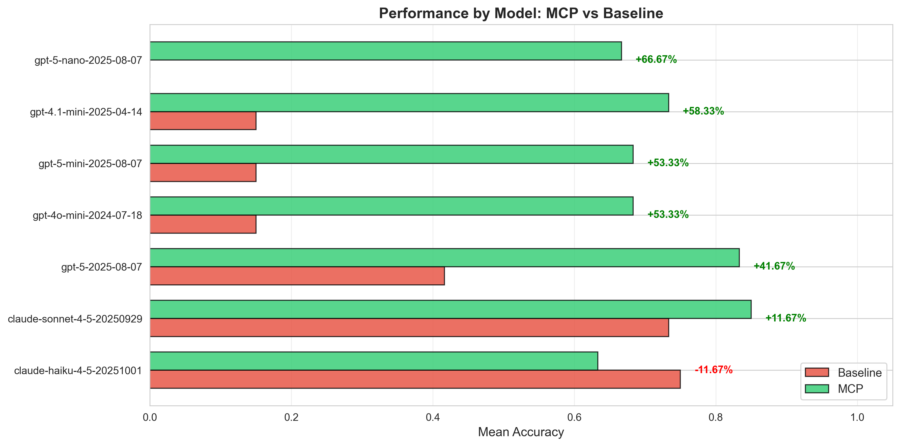

# Abstract

# Introduction

## Background

## Objectives

# Results

## Overview of the BioHackathon results

## EDAM-MCP workflow

## Use case: Metabolomics packages

## Benchmarking

# Discussion 

# Data availability

# Acknowledgements

# References
